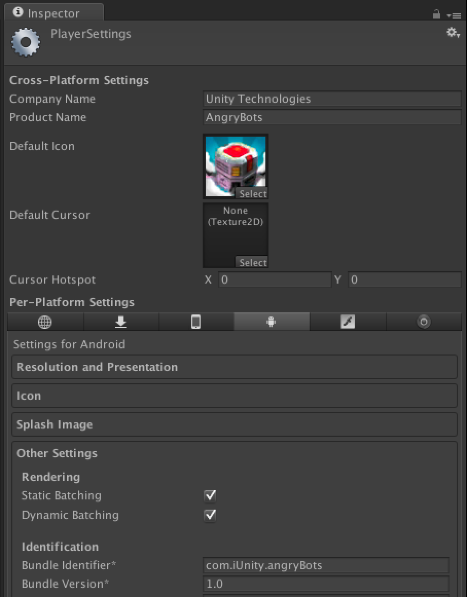

This repository contains the wrapper code and binaries for the unity plugins derived from the Appboy Android and iOS SDK's

Before you can start using Appboy in your Unity scripts, you'll need to import the plugin files to your Unity project. First, clone this repo. If you're not using any other plugins, all you have to do is copy the "Plugins" directory from this repo into the "Assets" folder of your Unity project. 

If you already have a "\<your-project>/Assets/Plugins" directory (probably because you're using another plugin already), copy "Plugins/AppboyBinding.cs" into "\<your-project>/Assets/Plugins". Then copy the contents of "Plugins/iOS" and "Plugins/Android" from this repo into "\<your-project>/Assets/Plugins/iOS" and "\<your-project>/Assets/Plugins/Android", respectively.

## iOS Setup Instructions
<ol>
<li>
First, generate your Xcode project in Unity by clicking on "File" -> "Build Settings...", then selecting iOS as the platform and clicking "Build". Unity should copy the files AppboyBinding.m, AppboyUnityManager.h, and AppboyUnityManager.mm to the "Classes" directory of your generated project. If it fails to do that, you can copy those files from this repo manually. You will need to manually add AppboyUnityManager.h to your Xcode project (even though it is already in the Classes directory) by right clicking on Classes and selecting "Add Files to ..."
</li>
<li>
Next, add the <a href="https://github.com/appboy/appboy-ios-sdk">Appboy iOS SDK</a> to your Xcode project by following the guidance under "Add Appboy to your Project," "Add the iOS Libraries," and "Configure the Appboy Library and Framework" in our iOS Integration Instructions at https://appboy.zendesk.com/entries/23714308-iOS-Getting-Started
</li>
<li>
Next, we'll need to make some modifications to your generated AppController.mm in the "Classes" folder of your Xcode project:
<ul>
<li>
At the top of the file add the following import statements:
<pre><code>#import "Appboy.h"
#import "AppboyUnityManager.h"
</code></pre>
</li>
<li>
In the method <code>applicationDidFinishLaunchingWithOptions</code>, add the following code block above the return statement, replacing "YOUR-API-KEY" with your Appboy API key:
<pre><code>[Appboy startWithApiKey:@"YOUR-API-KEY"
        inApplication:application
        withLaunchOptions:launchOptions];
[Appboy sharedInstance].slideupDelegate = [AppboyUnityManager sharedInstance];
</code></pre>
</li>
<li>
If you want to use push notifications, add this line to <code>applicationDidFinishLaunchingWithOptions</code>:
<pre><code>[[UIApplication sharedApplication] registerForRemoteNotificationTypes: 
          (UIRemoteNotificationTypeAlert | 
           UIRemoteNotificationTypeBadge |     
           UIRemoteNotificationTypeSound)];
</code></pre>
This line to <code>didRegisterForRemoteNotificationsWithDeviceToken</code>:
<pre><code>[[Appboy sharedInstance] registerPushToken:
                [NSString stringWithFormat:@"%@", deviceToken]];
</code></pre>
And this line to <code>didReceiveRemoteNotification</code>:
<pre><code>[[Appboy sharedInstance] registerApplication:application
                didReceiveRemoteNotification:userInfo];
</code></pre>
</li>
<li>
To help verify the code modifications you made, there is an example modified AppController.mm generated by Unity 4.1.2 in Docs/iOS in this repo.
</li>
</ul>
</li>
<li>
If you're using push notifications you'll need to follow the standard setup for Apple push which you can find at https://appboy.zendesk.com/entries/23690991-iOS-Push-Notifications
</li>
<li>
As you make updates to your app from Unity, you should choose the same location to generate the Xcode project each time. Unity will prompt you to replace or append the existing folder. If you choose "Append," you shouldn't have to redo any of your Appboy setup in the future.
</li>
</ol>

## Android Setup Instructions
<ol>
<li>
First, we'll confirm that you've copied the plugin folder correctly and identify all of the locations where you'll need to insert configuration specific to your app. From the root of your unity project, you should be able to run the following and find all of the locations that must be modified to fully setup Appboy for Android:
 
<code>
        grep -r REPLACE Assets/Plugins/
</code>
 
The output should look something like this:
<pre><code>Assets/Plugins/Android/AndroidManifest.xml:  package="REPLACE WITH YOUR.BUNDLE.ID" android:versionCode="1" android:versionName="0.0"&gt;
Assets/Plugins/Android/AndroidManifest.xml:  &lt;permission android:name="REPLACE WITH YOUR.BUNDLE.ID.permission.C2D_MESSAGE" android:protectionLevel="signature" /&gt;
Assets/Plugins/Android/AndroidManifest.xml:  &lt;uses-permission android:name="REPLACE WITH YOUR.BUNDLE.ID.permission.C2D_MESSAGE" /&gt;
Assets/Plugins/Android/AndroidManifest.xml:    &lt;meta-data android:name="com.appboy.APPBOY_API_KEY" android:value="REPLACE WITH YOUR STAGING API KEY" /&gt;&lt;!-- STAGING --&gt;
Assets/Plugins/Android/AndroidManifest.xml:        &lt;category android:name="REPLACE WITH YOUR.BUNDLE.ID" /&gt;
Assets/Plugins/Android/res/values/strings.xml:  &lt;string name="gcm_sender_id">REPLACE WITH YOUR GCM ID&lt;/string&gt;
</code></pre>
</li>
<li>Next, you need to find your "Bundle Identifier" from Unity. This is available from the Android tab of the "Player Settings" pane (accessible by clicking the Player Settings button in File -> Build Settings). The Player Settings pane looks like this in Unity 4: 
 

</li>
<li>
In AndroidManifest.xml, replace all instances of <code>REPLACE WITH YOUR.BUNDLE.ID</code> with the Bundle Identifier you found in Step 2. Your Bundle Identifier is usually of the form "com.unity.appname".
</li>
<li>
Now you must configure the Android manifest with the API key for your app. If you don't have your API key, simply login to the Appboy <a href="http://dashboard.appboy.com">dashboard</a>. If you don't have an app or account yet, you'll need to create them by following the wizard. Once you've created an app, navigate to the "Settings" page by clicking the gear icon to the right of your app name in the top left of the Apps tab. You can use the default Debug API Key that will have been created for you for debugging. When you're ready to deploy your application, you should update this to use your Production key.
</li>
<li>
Replace <code>REPLACE WITH YOUR STAGING API KEY</code> with the API key you retrieved in Step 4. It should look something like <code>"86bae89e-bb14-4678-9f55-ef6f92d80b98</code>.
</li>
<li>
For push notifications to work, you will now need to insert your GCM Sender ID from Google into the strings.xml resource file. If you don't have a GCM Sender ID yet, you'll need to follow the <a href="http://developer.android.com/google/gcm/gs.html">GCM setup instructions</a> from Google. Once you have the ID, change <code>REPLACE WITH YOUR GCM ID</code> to your GCM ID. Since the GCM ID is a number, you shouldn't surround the value with quotes. Your ID should look something like <code>134664038331</code>.
<li>
At this point, you should be able to run the grep command from Step 1 and have no results. If there are any additional instances of <code>REPLACE</code> remaining, repeat these steps.
</li>
<li>Next, you must configure push notifications on the Appboy <a href="http://dashboard.appboy.com">dashboard</a>. Navigate back to the "Settings" page by clicking the gear icon to the right of your app name. Under the Push Notifications section of the App Settings page, insert your GCM API key. This is different from your GCM Sender ID and can be found on the API Access page of your Google API project. Your Google Project API key should look something like <code>ABcdEfGHij1_klm2NOPQrwTuVWxyZ3A4bCDeF5g</code>. Please refer back to <a href="http"//developer.android.com/google/gcm/gs.html">GCM setup instructions</a> for more help.
</li>
<li>
Finally, you should confirm that your Android app is only targeting version 2.2 (Froyo) and above. This setting is available from the same "Player Settings" pane that you found the Bundle Identifier in during Step 2. Android versions previous to 2.2 represent a vanishingly small portion of active Android devices and are not supported by Appboy.
</li>
</ol>
